# Developing a Prototype GraphRAG-Based Chat Interface for Enhanced Access to National Archives and Records Administration Documents

The prototype is a chat interface based on **GraphRAG** that builds and uses a knowledge graph created from the National Archives Catalog dataset to answer natural-language questions by retrieving relevant document passages and constraining LLM generation to the provided context. At its core is a Neo4j knowledge graph with text nodes, vector embeddings and a vector index; retrieval is implemented as a hybrid of semantic embedding search + retrieval query.

# Knowledge Graph Construction Algorithm

**Phase 1 — Preparation**  
1.1. Import required libraries.  
1.2. Load the model for generating text embeddings.

**Phase 2 — Define data structure**  
2.1. Define functions to process different record types.  
2.2. For each record type, define the corresponding schemas to access data in the JSON structure.

**Phase 3 — Source data processing**  
3.1. Extract JSONL files.  
3.2. For each record:  
- 3.2.1. Extract core data according to the defined schemas.  
- 3.2.2. Process hierarchical relationships.  
- 3.2.3. Build the textual field.  
- 3.2.4. Split long texts into chunks.

**Phase 4 — Create graph nodes**  
4.1. For each node, create attributes based on the processed data according to the schema.  
4.2. Create constraints to ensure uniqueness of `chunkId`.

**Phase 5 — Create embeddings**  
5.1. Generate vector embeddings for all nodes that contain text.  
5.2. Save embeddings as node attributes for later semantic search.  
5.3. Create a vector index for efficient search.

**Phase 6 — Create relationships between nodes**  
6.1. Create `Next` relationships between chunks of the same document.  
6.2. Create `Includes` relationships based on hierarchical information.  
6.3. Create additional relationships between nodes based on the `naId` attribute values.

# List of attributes created for each node type

| **Entity** | **Properties** |
|-------------|----------------|
| item | file_name, line_num, ancestors, accessionNumbers, description_accessRestriction, note_accessRestriction, status_accessRestriction, audiovisual, beginCongress, authorityType_contributors, contributorType_contributors, heading_contributors, naId_contributors, logicalDate_coverageEndDate, logicalDate_coverageStartDate, custodialHistoryNote, groupName_dataControlGroup, dateNote, levelOfDescription, objectDescription_digitalObjects, objectType_digitalObjects, objectUrl_digitalObjects, endCongress, generalNotes, generalRecordsTypes, internalTransferNumbers, languages, localIdentifier, identifier_microformPublications, note_microformPublications, title_microformPublications, naId, description_onlineResources, note_onlineResources, url_onlineResources, otherTitles, partyDesignation, logicalDate_productionDates, recordsCenterTransferNumbers, recordType, scaleNote, scopeAndContentNote, authorityType_subjects, heading_subjects, naId_subjects, subtitle, title, transferNote, note_useRestriction, specificUseRestrictions_useRestriction, status_useRestriction, note_variantControlNumbers, number_variantControlNumbers, type_variantControlNumbers, copyStatus_physicalOccurrences, extent_physicalOccurrences, physicalOccurrenceNote_physicalOccurrences, text, chunkSeqId, chunkId, source |
| fileUnit | file_name, line_num, ancestors, accessionNumbers, description_accessRestriction, note_accessRestriction, status_accessRestriction, arrangement, audiovisual, beginCongress, authorityType_contributors, contributorType_contributors, heading_contributors, naId_contributors, logicalDate_coverageEndDate, logicalDate_coverageStartDate, custodialHistoryNote, groupName_dataControlGroup, dateNote, objectDescription_digitalObjects, objectType_digitalObjects, objectUrl_digitalObjects, editStatus, fileFormat_findingAids, findingAidtype_findingAids, note_findingAids, source_findingAids, url_findingAids, urlNote_findingAids, urlDescription_findingAids, endCongress, generalNotes, generalRecordsTypes, internalTransferNumbers, itemCount, languages, levelOfDescription, localIdentifier, naId, identifier_microformPublications, note_microformPublications, title_microformPublications, description_onlineResources, note_onlineResources, url_online_resources, otherTitles, partyDesignation, copyStatus_physicalOccurrences, extent_physicalOccurrences, physicalOccurrenceNote_physicalOccurrences, recordsCenterTransferNumbers, recordType, scaleNote, scopeAndContentNote, soundType, authorityType_subjects, heading_subjects, naId_subjects, subtitle, title, transferNote, note_useRestriction, specificUseRestrictions_useRestriction, status_useRestriction, note_variantControlNumbers, number_variantControlNumbers, type_variantControlNumbers, text, chunkSeqId, chunkId, source |
| series | file_name, line_num, ancestors, accessionNumbers, description_accessRestriction, note_accessRestriction, status_accessRestriction, arrangement, audiovisual, beginCongress, authorityType_contributors, contributorType_contributors, heading_contributors, naId_contributors, logicalDate_coverageEndDate, logicalDate_coverageStartDate, authorityType_creators, creatorType_creators, heading_creators, naId_creators, custodialHistoryNote, groupName_dataControlGroup, dateNote, dispositionAuthorityNumbers, editStatus, endCongress, fileUnitCount, fileFormat_findingAids, findingAidtype_findingAids, note_findingAids, source_findingAids, url_findingAids, urlNote_findingAids, functionAndUse, generalNotes, generalRecordsTypes, logicalDate_inclusiveEndDate, logicalDate_inclusiveStartDate, internalTransferNumbers, itemCount, languages, levelOfDescription, localIdentifier, identifier_microformPublications, note_microformPublications, title_microformPublications, naId, numberingNote, note_onlineResources, url_onlineResources, otherTitles, partyDesignation, copyStatus_physicalOccurrences, extent_physicalOccurrences, physicalOccurrenceNote_physicalOccurrences, recordsCenterTransferNumbers, recordType, scaleNote, soundType, authorityType_subjects, heading_subjects, naId_subjects, title, transferNote, note_useRestriction, specificUseRestrictions_useRestriction, status_useRestriction, note_variantControlNumbers, number_variantControlNumbers, type_variantControlNumbers, text, chunkSeqId, chunkId, source |
| recordGroup | file_name, line_num, beginCongress, logicalDate_coverageEndDate, logicalDate_coverageStartDate, groupName_dataControlGroup, dateNote, endCongress, fileFormat_findingAids, findingAidtype_findingAids, note_findingAids, source_findingAids, url_findingAids, urlNote_findingAids, logicalDate_inclusiveEndDate, logicalDate_inclusiveStartDate, levelOfDescription, naId, partyDesignation, recordGroupNumber, recordType, address1_referenceUnits, address2_referenceUnits, city_referenceUnits, email_referenceUnits, fax_referenceUnits, mailCode_referenceUnits, name_referenceUnits, phone_referenceUnits, postalCode_referenceUnits, state_referenceUnits, seriesCount, title, text, chunkSeqId, chunkId, source |
| collection | file_name, line_num, collectionIdentifier, logicalDate_coverageEndDate, logicalDate_coverageStartDate, groupName_dataControlGroup, dateNote, authorityType_donors, heading_donors, naId_donors, fileFormat_findingAids, findingAidtype_findingAids, note_findingAids, source_findingAids, url_findingAids, urlNote_findingAids, logicalDate_inclusiveEndDate, logicalDate_inclusiveStartDate, levelOfDescription, naId, recordType, address1_referenceUnits, address2_referenceUnits, city_referenceUnits, email_referenceUnits, fax_referenceUnits, mailCode_referenceUnits, name_referenceUnits, phone_referenceUnits, postalCode_referenceUnits, state_referenceUnits, seriesCount, title, note_variantControlNumbers, number_variantControlNumbers, type_variantControlNumbers, text, chunkSeqId, chunkId, source |
| geographicPlaceName | file_name, line_num, authorityType, description_broaderTerms, naId_broaderTerms, heading_broaderTerms, coordinates, heading, importRecordControlNumber, geographicPlaceName_linkCounts, jurisdiction_linkCounts, organization_linkCounts, subject_linkCounts, totalDescription_linkCounts, naId, naId_narrowerTerms, heading_narrowerTerms, naId_relatedTerms, heading_relatedTerms, recordSource, recordType, scopeNote, sourceNotes, useFor, text, chunkSeqId, chunkId, source |
| organization | file_name, line_num, administrativeHistoryNote, authorityType, naId_jurisdictions, name_jurisdictions, heading, contributor_linkCounts, creator_linkCounts, donor_linkCounts, subject_linkCounts, totalDescription_linkCounts, naId, contributorTypes_organizationNames, creatorTypes_organizationNames, heading_organizationNames, naId_organizationNames, name_organizationNames, recordSource_organizationNames, variantOrganizationNames, authorityType_personalReferences, heading_personalReferences, naId_personalReferences, programAreas, recordType, sourceNotes, text, chunkSeqId, chunkId, source |
| person | file_name, line_num, authorityType, biographicalNote, logicalDate_birthDate, logicalDate_deathDate, fullerFormOfName, heading, importRecordControlNumber, contributor_linkCounts, creator_linkCounts, donor_linkCounts, subject_linkCounts, totalDescription_linkCounts, naId, name, numerator, authorityType_organizationalReferences, heading_organizationalReferences, naId_organizationalReferences, personalTitle, recordSource, recordType, contributor_role, creator_role, donor_role, reference_role, sourceNotes, fullerFormOfName_variantPersonNames, heading_variantPersonNames, name_variantPersonNames, numerator_variantPersonNames, personalTitle_variantPersonNames, text, chunkSeqId, chunkId, source |
| specificRecordsTypes | file_name, line_num, authorityType, naId_broaderTerms, name_broaderTerms, heading, importRecordControlNumber, specificRecordsType_linkCounts, subject_linkCounts, totalDescription_linkCounts, naId, naId_narrowerTerms, heading_narrowerTerms, recordType, recordSource, naId_relatedTerms, heading_relatedTerms, scopeNote, sourceNotes, useFor, text, chunkSeqId, chunkId, source |
| topicalSubject | file_name, line_num, authorityType, naId_broaderTerms, name_broaderTerms, heading, subject_linkCounts, topicalSubject_linkCounts, totalDescription_linkCounts, naId, naId_narrowerTerms, heading_narrowerTerms, naId_relatedTerms, heading_relatedTerms, recordType, recordSource, scopeNote, sourceNotes, useFor, text, chunkSeqId, chunkId, source |

# Chat Interface Workflow

**Phase 1 — System initialization**  
1.1. Load environment variables for connecting to Neo4j and Hugging Face.  
1.2. Detect the available compute device (CPU/GPU).  
1.3. Load two models:  
- 1.3.1. The model for embedding generation.  
- 1.3.2. The language model for answer generation.

**Phase 2 — Embeddings components setup**  
2.1. Create an `Embeddings` class to convert texts into vector representations.
2.2. Configure the pipeline for text generation.

**Phase 3 — Retrieve relevant documents**  
3.1. Formulate a Cypher query to search the Neo4j graph:  
- 3.1.1. Find text nodes and expand context via `Next` relationships.  
- 3.1.2. Extract the document hierarchy via `Includes` relationships.
- 3.1.3. Collect related authoritative records.

3.2. Create a vector store based on the existing Neo4j graph.  
3.3. Use semantic search over embeddings to find relevant documents.

**Phase 4 — Query classification and answer generation**  
4.1. Classify the incoming query into one of two types:  
- `show_records` — a direct request to show records.  
- `question` — an informational question that requires an answer based on context.

4.2. For `show_records` queries, produce a structured list of found materials.  
4.3. For `question` queries:  
- 4.3.1. Construct a context from titles and texts of relevant documents.  
- 4.3.2. Generate an answer with a strict constraint to use only information from the context.  
- 4.3.3. If no answer exists in the context, return a standard "no data" message.

**Phase 5 — Formatting and presenting results**  
5.1. Format data as dialog "bubbles".  
5.2. For each document, include:  
- 5.2.1. Core information with dates and type.  
- 5.2.2. The hierarchy of records above it.  
- 5.2.3. Related authoritative records with clickable links.

# Flowchart Diagram

# Retrieval query

# Classification Prompt

# Answer Prompt

